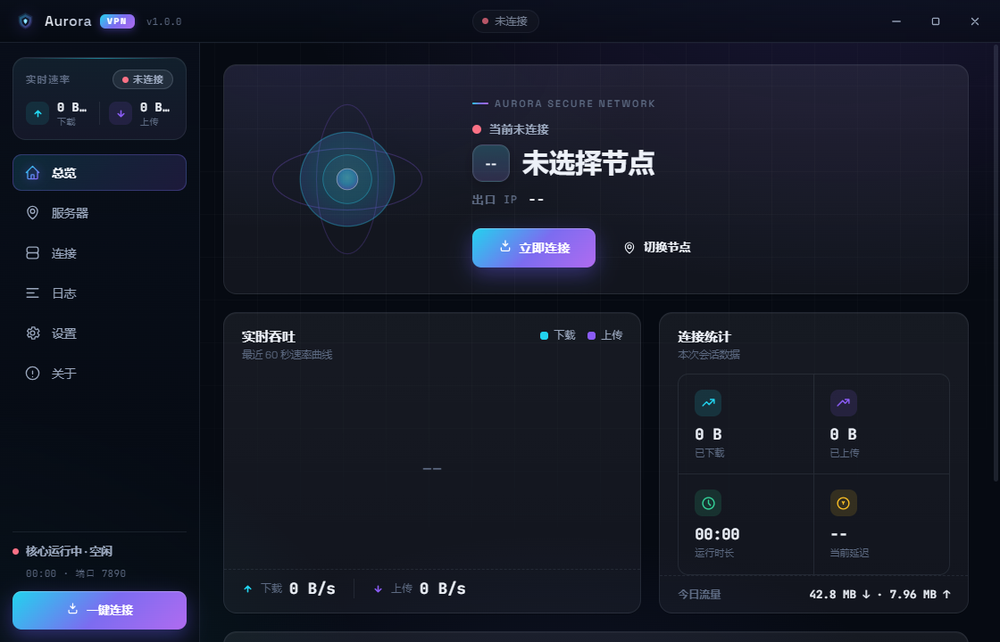
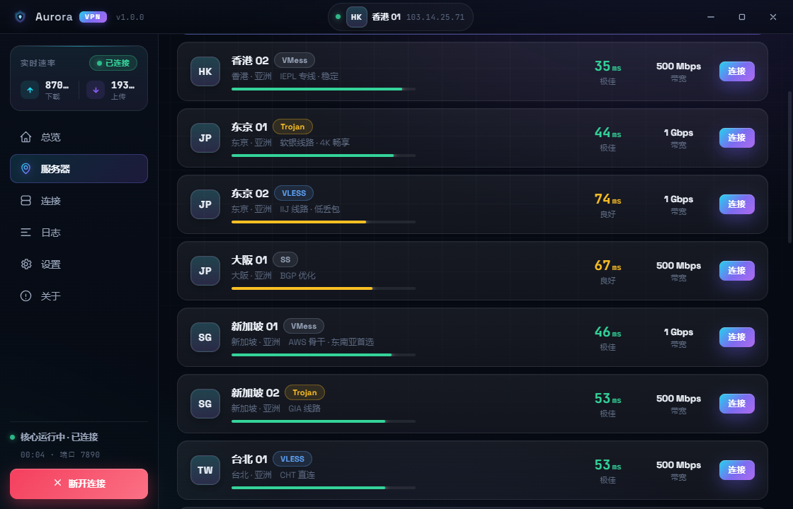
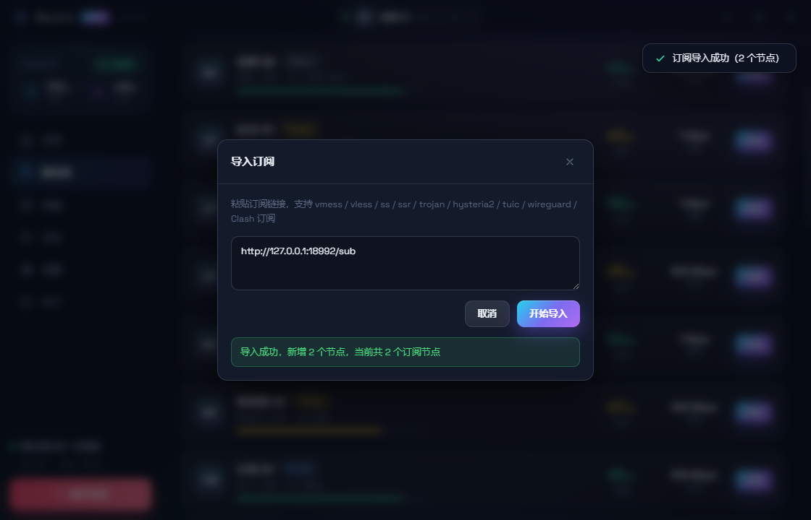
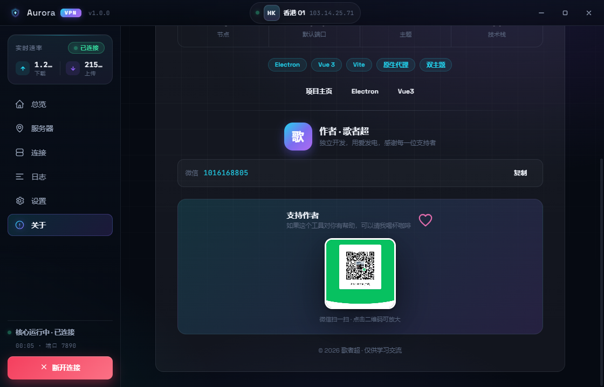

<div align="center">

# Aurora 极光代理客户端

**Aurora · A sleek Windows proxy client built with Electron + Vue 3 + Vite**

简约精致的 Windows 代理客户端：订阅导入 · 多协议解析 · Shadowsocks 加密隧道 · 系统代理 · 实时流量监控 · 双主题


</div>

Aurora 是一款界面精致、交互流畅的桌面代理客户端（Proxy Client），基于 Electron + Vue 3 + Vite 构建，运行于 Windows 10 / 11。支持订阅导入、多节点选择、系统代理、实时流量监控、连接会话管理与深色 / 浅色双主题切换。代理内核由主进程内的纯 Node.js 正向代理模块实现，零第三方代理内核依赖，单文件绿色便携，开箱即用。

- 技术栈：Electron 33 · Vue 3 · Vite 6 · Node.js
- 平台支持：Windows 10 / 11（x64）
- 发行形态：单文件便携版（无需安装）、NSIS 安装版

> 关键词 / Keywords：Windows 代理客户端 · 网络代理 Proxy · 订阅导入 Subscription · Shadowsocks (SS) · Clash 订阅解析 · 系统代理 System Proxy · 实时流量监控 Traffic Monitor · 加密隧道 · 网络代理工具 · Electron · Vue 3 · Vite · JavaScript · Node.js · 桌面应用

## 目录

- [项目介绍](#项目介绍)
- [功能特性](#功能特性)
- [界面预览](#界面预览)
- [技术架构](#技术架构)
- [项目结构](#项目结构)
- [快速开始](#快速开始)
- [从源码构建](#从源码构建)
- [使用说明](#使用说明)
- [操作手册](#操作手册)
- [协议支持说明](#协议支持说明)
- [常见问题](#常见问题)
- [软件更新](#软件更新)
- [参与贡献](#参与贡献)
- [作者与联系方式](#作者与联系方式)
- [支持与打赏](#支持与打赏)
- [免责声明](#免责声明)
- [License](#license)

## 项目介绍

Aurora 是一个界面精致、交互流畅的桌面代理客户端，适合需要"轻量、好看、够用"的代理工具的普通用户，也适合想学习 Electron + Vue 3 桌面应用开发的开发者参考。

它参考了主流代理客户端（如 Clash 系）的交互范式，用更轻的技术实现：不依赖任何外部代理内核，由主进程内的正向代理模块直接接管 HTTP / HTTPS 流量，并通过 Windows 注册表自动切换系统代理，实现"一键连接、全局生效"。加密隧道转发基于 Shadowsocks 协议实现，具备真实、可用的代理能力。

## 功能特性

- **订阅导入**：粘贴订阅链接一键导入节点，自动识别国家 / 地区并归档
- **多协议解析**：支持解析 vmess / vless / ss / ssr / trojan / hysteria2 / tuic / wireguard / Clash YAML 订阅
- **批次管理**：每次导入独立成批，支持一键删除整批节点，旧节点自动归入「历史导入」
- **一键连接 / 断开**，支持系统代理自动开关
- **实时流量监控**：上传 / 下载速度、累计流量、今日用量、运行时长、实时速度曲线
- **连接会话管理**：实时查看当前活跃的代理连接
- **完整日志系统**：记录启动、连接、代理等事件
- **顶部信息栏**：自动显示日期、城市天气与连接状态
- **深色 / 浅色双主题**：紫青科技风深色 + 央视红金白浅色，全局设计系统统一，雷达、速率、图表、按钮均随主题自适应配色
- **原生 Windows 托盘**：关闭最小化到托盘，后台常驻
- **版本更新**：启动自动检查 + 「关于」页手动检查，优先比对 Gitee（同款发布在 GitHub 兜底），下载完成即可自动升级并打开新版
- **纯 Node.js HTTP / HTTPS 正向代理**，无第三方代理内核依赖
- **单文件绿色便携版**，双击即用，无需安装

## 界面预览

> 以下截图为深色主题；浅色主题（央视红金白）在「设置 → 外观 → 主题」中切换查看。









## 技术架构

整体采用 Electron 主进程 / 渲染进程分离架构，渲染层通过 preload 暴露的 contextBridge 与主进程进行 IPC 通信。

```
┌──────────────────────────────────────────────┐
│  渲染进程 Renderer（Vue 3 + Vite）             │
│  Dashboard / Servers / Connections            │
│  Logs / Settings / About                      │
└───────────────────┬──────────────────────────┘
                    │ IPC（preload contextBridge）
┌───────────────────┴──────────────────────────┐
│  主进程 Main Process（Electron）               │
│  ┌─────────┐ ┌──────────┐ ┌──────────────┐   │
│  │  Core    │ │ Proxy    │ │ System Proxy │   │
│  │ 状态机    │ │ 代理服务器 │ │ 系统代理      │   │
│  └─────────┘ └──────────┘ └──────────────┘   │
│  ┌─────────┐ ┌──────────┐ ┌──────────────┐   │
│  │ Servers │ │ 订阅解析  │ │ SS 加密客户端  │   │
│  │ 节点列表 │ │ Subscription│ │ ss-client     │   │
│  └─────────┘ └──────────┘ └──────────────┘   │
│  ┌─────────┐ ┌──────────┐                     │
│  │ Settings │ │ Weather  │                     │
│  │ 持久化设置 │ │ 天气服务  │                     │
│  └─────────┘ └──────────┘                     │
└───────────────────┬──────────────────────────┘
                    │ 127.0.0.1:7891
┌───────────────────┴──────────────────────────┐
│  网络流量（HTTP / HTTPS）                      │
└──────────────────────────────────────────────┘
```

各模块职责：

- `electron/main.js`：应用入口，负责窗口、托盘、IPC 通信与生命周期管理
- `electron/preload.js`：contextBridge 安全桥接，向渲染层暴露受限 API
- `electron/core.js`：连接状态机、真实流量统计、运行时日志
- `electron/proxy-server.js`：HTTP / HTTPS 正向代理服务器，接管本地代理流量
- `electron/ss-client.js`：Shadowsocks 加密 / 解密客户端，负责真实节点转发
- `electron/system-proxy.js`：通过 Windows 注册表配置 / 恢复系统代理
- `electron/servers.js`：节点数据、订阅节点合并 / 增删 / 批次管理
- `electron/subscription.js`：订阅链接抓取与多协议解析（含 Clash YAML）
- `electron/weather.js`：基于 IP 定位的天气服务（含降级策略）
- `electron/settings-store.js`：基于 JSON 文件的设置持久化
- `src/`：Vue 3 渲染层，含设计系统、状态管理、六个功能页面与可视化组件

## 项目结构

```
├── electron/                # Electron 主进程
│   ├── main.js              # 入口：窗口、托盘、IPC
│   ├── preload.js           # contextBridge 桥接
│   ├── core.js              # 连接状态机 / 流量统计
│   ├── proxy-server.js      # HTTP/HTTPS 正向代理
│   ├── ss-client.js         # Shadowsocks 加密客户端
│   ├── system-proxy.js      # Windows 系统代理
│   ├── servers.js           # 节点数据 / 批次管理
│   ├── subscription.js      # 订阅解析（多协议 + Clash YAML）
│   ├── weather.js           # 天气服务
│   └── settings-store.js    # 设置持久化
├── src/                     # Vue 3 渲染层
│   ├── pages/               # 仪表盘/节点/连接/日志/设置/关于
│   ├── components/          # 标题栏/侧边栏/雷达/速度曲线等
│   ├── styles/main.css      # 设计系统（CSS 变量与主题）
│   ├── utils/               # 格式化 / 提示 / 天气图标
│   └── store.js             # 全局响应式状态
├── build/                   # 打包图标资源
├── docs/                    # 文档与素材（截图、打赏码）
├── electron-builder.yml     # 打包配置
├── vite.config.js           # Vite 配置
└── package.json
```

## 快速开始

### 直接使用发行版

从 [Releases](releases) 下载 `Aurora-1.0.17-portable.exe`，双击运行即可，无需安装。

1. 启动后进入左侧「节点」页，点击「导入订阅」粘贴订阅链接
2. 导入成功后，点击任一节点卡片即可选中（可先做延迟测试）
3. 回到「仪表盘」点击连接
4. 开启「系统代理」后，浏览器等应用即可走代理访问

### 运行环境要求

- Windows 10 / 11（x64）
- 从源码构建需要 Node.js 18+ 与 npm

## 从源码构建

```bash
# 安装依赖
npm install

# 开发模式（构建渲染层并启动应用）
npm run dev

# 仅构建渲染层
npm run build

# 打包单文件便携版（执行前已自动 vite build）
npm run dist

# 打包 NSIS 安装版
npm run dist:installer
```

构建产物输出到 `release/` 目录。项目已在 `electron-builder.yml` 中配置 Electron 下载镜像为 `npmmirror`，国内环境通常无需额外配置；若下载仍缓慢，也可在项目根目录新建 `.npmrc`：

```
electron_mirror=https://npmmirror.com/mirrors/electron/
```

## 使用说明

- 默认代理端口：7891（可在「设置」中修改，重连后生效）
- 系统代理：开启后自动配置 Windows 系统代理，断开连接时自动恢复
- 主题：深色（紫青科技风）/ 浅色（央视红金白）双主题，在「设置」中切换
- 托盘：关闭窗口默认最小化到托盘，可在设置中关闭
- 订阅批次：每次导入自动生成一个批次，支持整批删除；重新导入同一订阅会刷新配置而不破坏已有批次

## 操作手册

便携版安装包位置：`release/Aurora-1.0.17-portable.exe`（单文件，双击即用，无需安装；被安全软件提示时选择"更多信息 → 仍要运行"）。

为不同用户准备了详细的操作手册（HTML 版，浏览器打开即可阅读）：

- [小白版操作手册](docs/manuals/小白版操作手册.html)：面向零基础用户，从"安装包在哪、怎么启动"到"导入订阅、一键连接、常见问题"的图文步骤
- [程序员版操作手册](docs/manuals/程序员版操作手册.html)：面向开发者，覆盖从源码运行、目录结构、二次开发到打包发布的全流程

## 协议支持说明

- 订阅导入阶段支持解析 `vmess`、`vless`、`ss`、`ssr`、`trojan`、`hysteria2`、`tuic`、`wireguard` 以及 Clash YAML 格式。
- 真实连接（加密隧道转发）目前完整支持 Shadowsocks（SS）节点。
- 其它协议的节点导入后仍可查看与管理，但连接时会提示「暂不支持直连」，请在后续版本中关注更新。

## 常见问题

- **无法访问网站**：确认已连接成功、系统代理已开启，且浏览器未使用其它代理插件。
- **导入订阅失败**：检查订阅链接是否以 `http://` 或 `https://` 开头，且网络可访问该链接。
- **节点显示「需重新导入」**：该节点为旧版本导入，缺少加密配置，请重新「导入订阅」刷新。
- **更改端口后未生效**：修改端口后需先断开再重新连接。

## 软件更新

软件启动后延时约 3 秒会自动检查一次更新，也可在「关于」页点击「检查更新」手动检查。版本号比对通过 Gitee 与 GitHub 两个仓库进行：

- **优先 Gitee**：先查询 Gitee 仓库 `mdw521/aurora-ladder` 的最新发行版（国内更稳、不受 GitHub 访问限制）
- **GitHub 兜底**：Gitee 不可达时回退查询 GitHub 仓库 `mdw-0254/aurora-ladder`
- **下载多源回退**：Gitee 直链(优先) → GitHub 加速镜像（ghfast.top / gh.ddlc.top / gh-proxy.com）→ GitHub 直连，任一来源失败自动切换，并对下载做完整性校验

更新仓库已在 `electron/main.js` 顶部配置为：

```js
const UPDATE_OWNER  = 'mdw-0254';   // GitHub
const UPDATE_REPO   = 'aurora-ladder';
const GITEE_OWNER   = 'mdw521';     // Gitee（优先）
```

### 自动更新（便携版）

便携版下载完成后，界面出现「更新已就绪」，点击「**立即关闭并更新**」即可：

1. 程序先真正退出（会绕开「关闭到托盘」，所以请点按钮而非仅点窗口 ×）
2. 待主程序完全退出后，自动**启动已下载的新版 exe**（以独立文件运行，不做覆盖操作，避免被安全软件拦截）
3. 自动打开新版本窗口，即完成升级

> 说明：升级过程的关键步骤会写入安装包所在目录的 `update.log`，便于排查（杀软拦截 / 退出时序等）。

### 发布新版

1. 修改 `package.json` 的 `version` 字段
2. `npm run dist` 打包生成 `release/Aurora-<版本>-portable.exe`
3. 到 **Gitee**（`mdw521/aurora-ladder`）新建「发行版」，Tag 填 `v1.X.Y`（带 `v` 前缀，数值与 version 一致），上传 exe 附件
4. 到 **GitHub**（`mdw-0254/aurora-ladder`）发布同款，作为兜底下载源

用户下次启动或手动检查时即可收到更新提示并一键升级。

## 参与贡献

欢迎贡献代码、提交 Issue、完善文档或反馈建议。请先阅读 [CONTRIBUTING.md](CONTRIBUTING.md) 了解开发流程与代码规范，并遵守 [CODE_OF_CONDUCT.md](CODE_OF_CONDUCT.md)。

- 报告问题 / 建议：GitHub Issues
- 提交代码：Fork → 新建分支 → 提交 → Pull Request
- 发现安全漏洞：请参阅 [SECURITY.md](SECURITY.md)，勿在公开渠道直接披露

## 作者与联系方式

作者：歌者超

- 微信：`1016168805`

欢迎交流、提 Issue、Star，也欢迎一起完善功能。

## 支持与打赏

如果这个工具对你有帮助，可以请作者喝杯咖啡，微信扫一扫即可打赏：


## 免责声明

本项目仅用于学习与技术交流。请勿将本项目用于任何违反所在地区法律法规的用途，因使用本项目产生的任何后果由使用者自行承担。请遵守当地法律，合理、合法地使用网络。

## License

[MIT](LICENSE)
